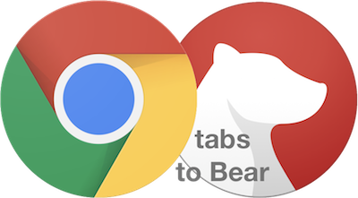
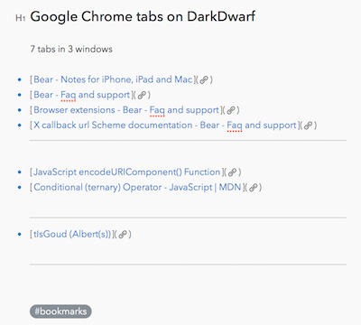
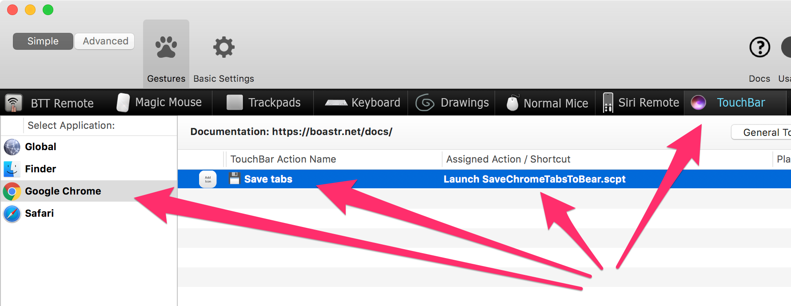

# Save Google Chrome tabs to Bear

This AppleScript saves all tabs and URLs from the Google Chrome windows to a new entry in Bear.

To content of the Bear-note is created as markdown and is generated via the x-call-back-url mechanism.

The entry contains the tab names and URLs as clickable links.  
URLs are grouped per browser window and seperated by a horizontal rule.   
A "Bookmarks" tag is added, the number of tabs and windows is displayed just below the title and in the title the name of the computer is used to identfy from which computer this entry originated.

By default the entry uses the tag "Bookmarks". You can change the name of the tag at the top of the script.

Next steps:

- Download the zip file or clone this repository. 
- Run it from the Script Editor to test the script in your environment.

Once you made sure it works on your system you can:

- Turn it into a Automator workflow to create a Service.
	- More information: [Use Automator to create a System-Wide service](https://developer.apple.com/library/content/documentation/LanguagesUtilities/Conceptual/MacAutomationScriptingGuide/MakeaSystem-WideService.html) or
- Use [BetterTouchTool](https://www.boastr.net) to set up a keybinding or
- Use [BetterTouchTool](https://www.boastr.net) to create a Touch Bar button.

I went for the last option 😉

BetterTouchTool configuration:

The resulting Touch Bar button:

